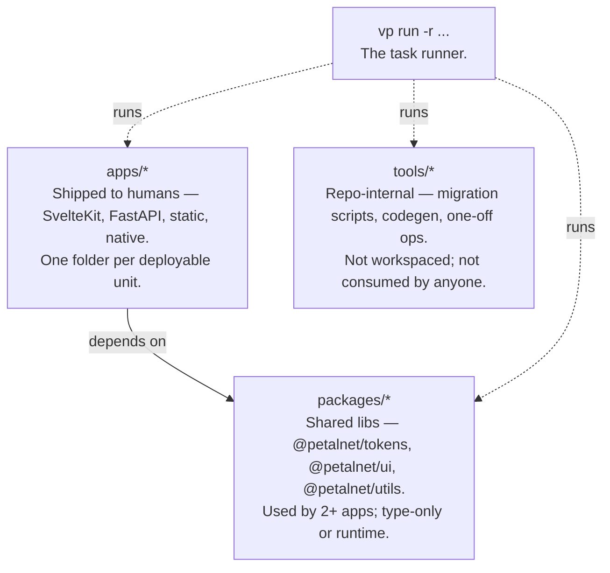
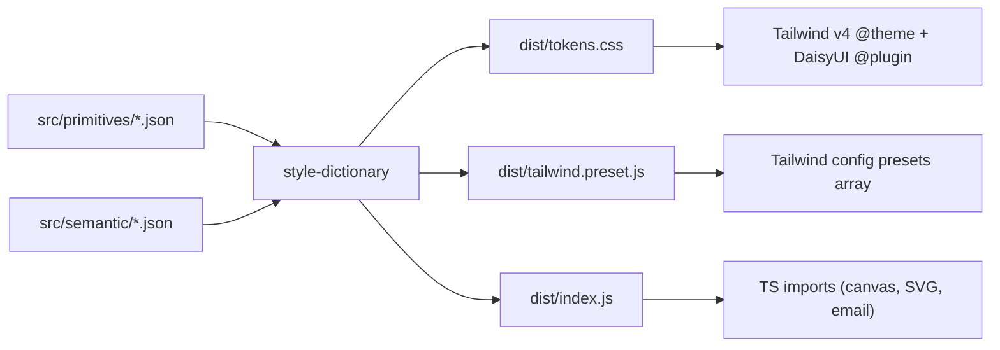
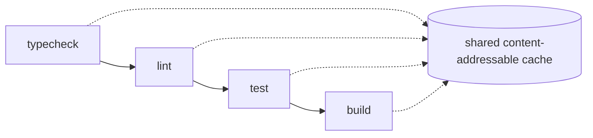
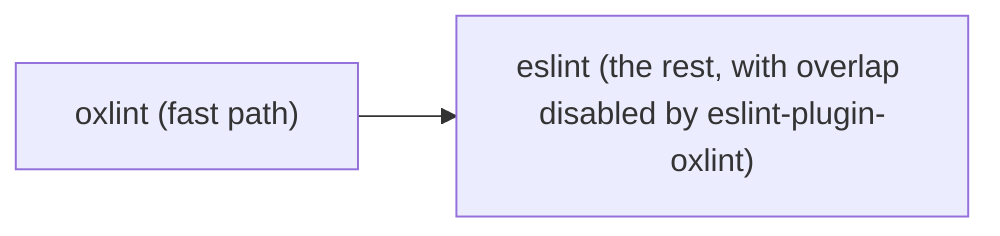

# Architecture

How this monorepo wants to be used.

## Three-tier dependency layout

Apps depend on packages. Packages depend on other packages (sparingly). Apps never depend on each other directly — extract the shared bit to a package.

## Tokens flow

DTCG is the authoring source. Tailwind + DaisyUI are the runtime. The semantic layer is what theme-switches; primitives stay the same across themes.

## Task graph (vp run)

Per `vite.config.ts`:

`vp run -r build` walks the workspace package dependency graph, hits each app/package's `build` script, caches output by content + env. Rebuilds skip the cache on miss; everything else replays.

## Lint pipeline

oxlint runs first because it's ~10-100x faster on the same rules. The overlap-disable preset is regenerated from `.oxlintrc.json` so what oxlint enables, eslint stops reporting.

## CI

`.github/workflows/ci.yml`: pnpm install → `vp run --cache` typecheck/lint/test/build, plus `manypkg check`, `typesync --dry=fail`, and `knip`. Fail-fast; no auto-merge of major bumps.

## Adding an app

1. Open an issue using the **New app** template (sanity check on naming + owner).
2. Scaffold under `apps/<slug>/` with workspace name `@petalnet/<slug>`.
3. Wire its scripts (`build`, `dev`, `test`, `lint`, `typecheck`) so `vp run` picks them up.
4. Add `@petalnet/tokens` if it has any styled surface.

## Migrating an existing repo

See `docs/MIGRATION.md` for the method + audit trail.
