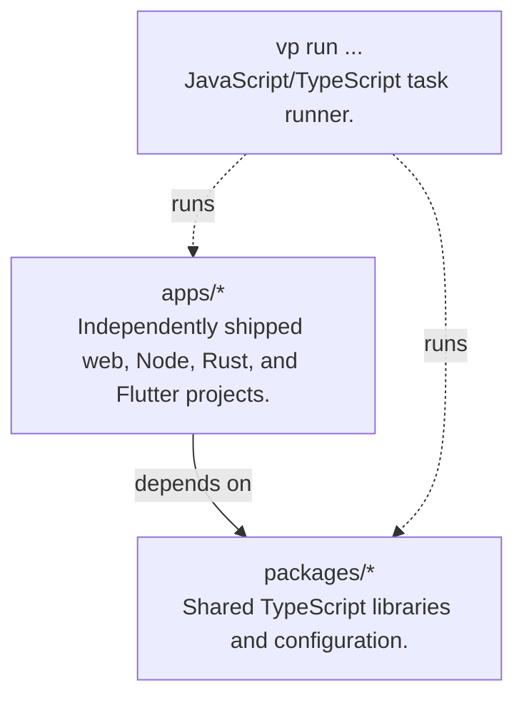
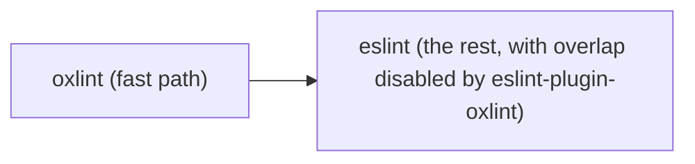

# Architecture

How this monorepo is organized and operated.

## Dependency layout


```mermaid
flowchart TD
    apps["apps/*<br/>Independently shipped web, Node, Rust, and Flutter projects."]
    packages["packages/*<br/>Shared TypeScript libraries and configuration."]
    runner["vp run ...<br/>JavaScript/TypeScript task runner."]

    apps -->|depends on| packages
    runner -.->|runs| apps
    runner -.->|runs| packages
```

JavaScript and TypeScript apps depend on packages, and packages depend on other
packages sparingly. They should not depend directly on another app; extract shared
code to a package. Native Cargo workspaces may use path dependencies between app
crates where they form one Rust subsystem—for example, Box Agent and Control Plane
reuse Dispatcher contracts.

`pnpm-workspace.yaml` includes `apps/*` and `packages/*`. Directories without a
`package.json` (including the Rust applications and Point's Flutter client)
retain their native Cargo or Flutter workflow rather than becoming pnpm packages.
Dependency versions for pnpm projects are centralized in strict catalogs there.

## Root tasks and Vite+

`package.json` is the source of truth for root scripts. The main entry points are:

```sh
vp run check
vp run test
vp run build
```

The root `check` script runs recursive typechecks with caching and a concurrency
limit, then root lint and formatting checks. `test` and `build` recursively run
the corresponding scripts exposed by workspace packages. Projects only
participate in tasks they actually declare; the repository does not define an
extra task-dependency graph.

`vite.config.ts` enables caching for package scripts and configures Vite+'s
formatter (tabs, double quotes, semicolons, import and Tailwind class sorting).
It intentionally does not define custom build or typecheck tasks, because those
remain customizable per package.

## Lint pipeline


```mermaid
flowchart LR
    oxlint["oxlint (fast path)"] --> eslint["eslint (the rest, with overlap disabled by eslint-plugin-oxlint)"]
```

oxlint runs first because it's ~10-100x faster on the same rules. The overlap-disable preset is regenerated from `.oxlintrc.json` so what oxlint enables, eslint stops reporting.

## CI

`.github/workflows/ci.yml` installs the pinned Node/pnpm/Vite+ toolchain, then
runs `vp run check`, `vp run test`, manypkg, a dedupe check, typesync, and both
Knip modes. A separate job runs `vp run build`. Additional jobs validate the
Rust applications, Point's Rust and Flutter projects, spelling, and links.
Release workflows build the Console and Point container images when their
relevant paths change.

## Adding an app

1. Open an issue using the **New app** template (sanity check on naming + owner).
2. Scaffold under `apps/<slug>/` with workspace name `@petalnet/<slug>`.
3. Add the scripts the project supports (for example `build`, `dev`, `test`, or
   `typecheck`) so recursive `vp run` commands can discover them.

## Migrating an existing repo

See [`MIGRATION.md`](./MIGRATION.md) for the method and historical audit trail.
