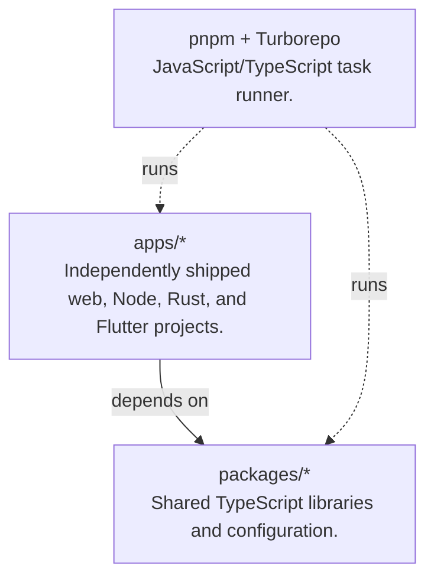
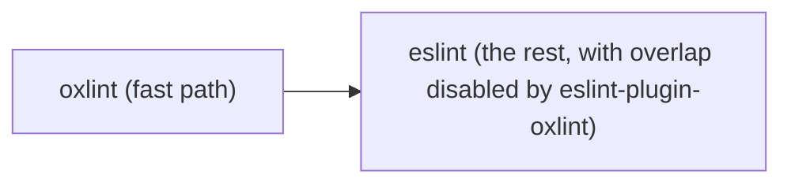

# Architecture

How this monorepo is organized and operated.

## Dependency layout


```mermaid
flowchart TD
    apps["apps/*<br/>Independently shipped web, Node, Rust, and Flutter projects."]
    packages["packages/*<br/>Shared TypeScript libraries and configuration."]
    runner["pnpm + Turborepo<br/>JavaScript/TypeScript task runner."]

    apps -->|depends on| packages
    runner -.->|runs| apps
    runner -.->|runs| packages
```

JavaScript and TypeScript apps depend on packages, and packages depend on other
packages sparingly. They should not depend directly on another app; extract shared
code to a package. Native Cargo workspaces may use path dependencies between app
crates where they form one Rust subsystem—for example, Box Agent and Control Plane
reuse Dispatcher contracts.

`pnpm-workspace.yaml` includes `apps/*` and `packages/*`. Directories without a
`package.json` (including the Rust applications and Point's Flutter client)
retain their native Cargo or Flutter workflow rather than becoming pnpm packages.
Dependency versions for pnpm projects are centralized in strict catalogs there.

## Root tasks and Turborepo

`package.json` owns workflow scripts and `turbo.json` owns deterministic,
cacheable repository tasks. The main entry points are:

```sh
pnpm check
pnpm test
pnpm build
```

The root `check` selects both `check` and `typecheck`, including SvelteKit apps,
alongside root lint, formatting, and workspace hygiene checks. Build and test scripts use
standalone Vite and Vitest. Root tasks are explicitly registered with `//#` keys.
`oxfmt.config.ts` owns formatting (tabs, double quotes, semicolons, import and
Tailwind class sorting); `oxlint.config.ts` owns the shared lint policy.

Turbo hashes tracked and new package files, root configuration, all shared
`packages/**` source (including adapter templates), repository `tools/**`, and ignored `.env*` files.
Generated outputs and dependency caches are excluded. Conservative shared-package
invalidation covers source imports without build scripts and relative tsconfig
references. App-local contracts are included by the default package inputs.
Build outputs and TypeScript emit/build-info files are restored together.
Output directories are not automatically cleaned before tasks or cache restores,
preserving incremental compiler state. Turbo overlays cached archives, so obsolete
files from another build can remain in an existing checkout; this is an accepted
tradeoff. Run a package's cached build through
`pnpm exec turbo run build --filter=@petalnet/<app>`, not its bare build script.
Run top-level build, check, and test workflows sequentially within one checkout:
builds and framework generation share output directories. Parallel CI jobs use
separate checkouts; separate Turbo processes do not coordinate these mutations.

Environment variables listed in `globalEnv` are hashed and passed through strict
environment mode. Add new build-sensitive variables or prefixes there; do not use
unhashed passthrough for cached tasks. Add external cross-app/root-directory reads
to the input model before caching them. Cache archives can contain compiled env
values: use disposable build settings in CI, never production credentials.

Prisma generation and framework preparation are uncached prerequisites. Checks
regenerate framework types even on hits rather than archiving mutable `.svelte-kit`
state. Database mutations, migrations and dev servers are not cacheable graph tasks. Tests default
to uncached; only pure suites opt in. Grove's and the adapter's PostgreSQL-backed
Testcontainers suites run live every time. New external-state suites must remain
uncached. Change these policies in `turbo.json`, not in custom hashing wrappers.

## Lint pipeline


```mermaid
flowchart LR
    oxlint["oxlint (fast path)"] --> eslint["eslint (the rest, with overlap disabled by eslint-plugin-oxlint)"]
```

Oxlint runs first because it's ~10-100x faster on the same rules. Both Oxlint and
`eslint-plugin-oxlint` consume `oxlint.config.ts`, so Oxlint's enabled rules are the
single source of truth for disabling overlap in ESLint. Type-aware ESLint runs in
sequential, cached shards to bound memory. Graph dependencies wait for app checks
to finish generating framework types before ESLint reads them; Knip follows ESLint
to avoid competing for memory. These prerequisites also apply to focused Turbo
lint invocations.

## CI

`.github/workflows/ci.yml` uses `pnpm/setup` to install Node/pnpm from `package.json`,
cache the pnpm store, and install dependencies with a required frozen lockfile.
Mise bootstraps pnpm locally and in orbs; pnpm provisions Node. `rharkor/caching-for-turbo` connects
Turbo's remote-cache protocol to GitHub's per-task cache, namespaced by OS and
architecture, without Vercel credentials or whole-directory cache snapshots.

The check job runs `pnpm check`: one Turbo graph for typechecks, formatting,
lint, manypkg, dedupe, typesync, and both Knip modes. Independent tasks run two at
a time; dependency edges protect generated files and bound heavy-check memory.
`--continue=always` collects every diagnostic even when a prerequisite fails and
still exits nonzero. Dedupe and typesync run uncached because they inspect installed
or registry state. Test and build jobs run in parallel in separate checkouts so
Vite's framework generation and build output writes cannot race with the checks.
Additional jobs validate the Rust applications, Point's Rust and Flutter projects,
spelling, and links. Release
workflows build the Point container image when its relevant paths change.

## Adding an app

1. Open an issue using the **New app** template (sanity check on naming + owner).
2. Scaffold under `apps/<slug>/` with workspace name `@petalnet/<slug>`.
3. Add package scripts (for example `build`, `dev`, `test`, `check`, or `typecheck`)
   and review their inputs, outputs, environment, and prerequisites in `turbo.json`.

## Migrating an existing repo

See [`MIGRATION.md`](./MIGRATION.md) for the method and historical audit trail.
