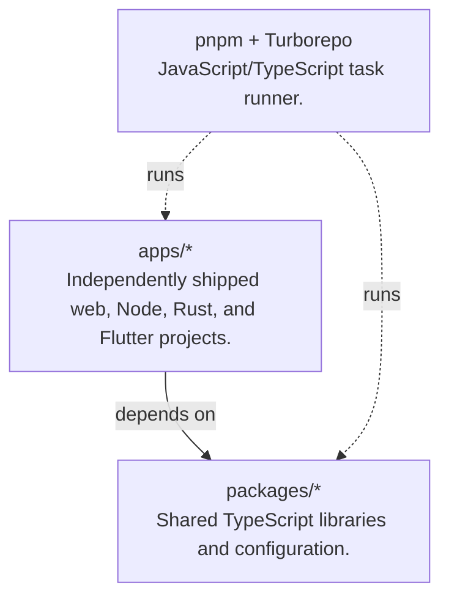
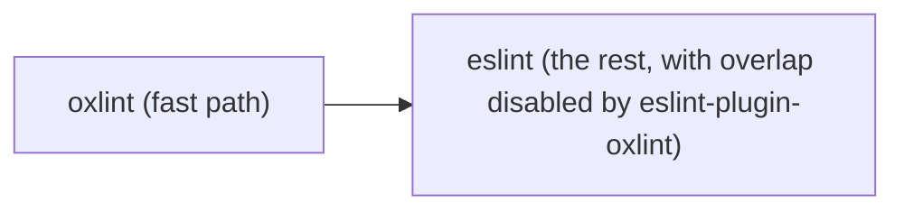

# Architecture

How this monorepo is organized and operated.

## Dependency layout


```mermaid
flowchart TD
    apps["apps/*<br/>Independently shipped web, Node, Rust, and Flutter projects."]
    packages["packages/*<br/>Shared TypeScript libraries and configuration."]
    runner["pnpm + Turborepo<br/>JavaScript/TypeScript task runner."]

    apps -->|depends on| packages
    runner -.->|runs| apps
    runner -.->|runs| packages
```

JavaScript and TypeScript apps depend on packages, and packages depend on other
packages sparingly. They should not depend directly on another app; extract shared
code to a package. The root Cargo workspace uses path dependencies between app
crates where they form one Rust subsystem—for example, Box Agent and Control Plane
reuse Dispatcher contracts.

`pnpm-workspace.yaml` includes `apps/*` and `packages/*`. Directories without a
`package.json` (including the Rust applications and Point's Flutter client)
retain their native Cargo or Flutter workflow rather than becoming pnpm packages.
Dependency versions for pnpm projects are centralized in strict catalogs there.

## Rust workspace

The root `Cargo.toml` owns eleven server/service crates, resolver 3, Courier's
inherited dependencies and the release profile. All eleven crates inherit the
workspace lint policy: warnings are denied, including pedantic/nursery Clippy
findings, without requiring command-line lint flags. Root
`rust-toolchain.toml` pins Rust 1.96; Mise installs it lazily with
`mise install --locked rust`. Member editions remain unchanged. Root
`Cargo.lock` and `target/` are shared; app-local Cargo locks and toolchain pins
are unnecessary. Release builds enable LTO and stripping for every member,
extending the fleet apps' existing policy to Courier and Point.

Fleet apps use the workspace's bundled rusqlite 0.37 to match Matrix SDK 0.14's
SQLite binding. Cargo permits only one `sqlite3` native links version per
lockfile; SQLx 0.9 accepts the shared libsqlite3-sys 0.35 binding. Changing this
dependency requires checking compatibility across all three consumers.

Point's Flutter bridge is explicitly excluded. It keeps a standalone Cargo
workspace, lockfile and per-ABI output layout while depending on `point-core`
by path. It inherits the repository Rust toolchain, not the root release profile.

From the repository root, `cargo ... --workspace` selects all service crates.
Use `-p <crate>` for focused operations; `-p 'courier*'` selects Courier's five
crates for build, test and Clippy. `cargo fmt` requires exact package names.
App jobs remain separate and package-scoped so Point's PostgreSQL and Manager's
tmux tests retain their environment requirements. Point's image and Manager's
Nix/container builds consume root workspace inputs but build only their service.
Point releases also watch root Cargo and toolchain changes.

Cargo unification is independent of experimental Turbo Rust integration.
`turbo.json` continues to orchestrate only pnpm projects until native Cargo task
selection and caching are validated separately.

## Root tasks and Turborepo

`package.json` owns workflow scripts and `turbo.json` owns deterministic,
cacheable repository tasks. The main entry points are:

```sh
pnpm check
pnpm test
pnpm build
```

The root `check` selects both `check` and `typecheck`, including SvelteKit apps,
alongside root lint, formatting, and workspace hygiene checks. Build and test scripts use
standalone Vite and Vitest. Root tasks are explicitly registered with `//#` keys.
`oxfmt.config.ts` owns formatting (tabs, double quotes, semicolons, import and
Tailwind class sorting); `oxlint.config.ts` owns the shared lint policy.

Turbo hashes tracked and new package files, root configuration, all shared
`packages/**` source (including adapter templates), and repository `tools/**`.
Vite loads a package's `.env`, `.env.local`, `.env.[mode]` and `.env.[mode].local` inside
the task, after Turbo hashes, and those files can flip `import.meta.env.DEV`. So `build` and
the cached Vitest suites hash the package's `.env*` files, ignored or not. Ignored root
files (`.env*`, logs) are not hashed. A laptop without local dotenv files computes the same
task hashes as CI; one with an app `.env` or `.env.local` misses on that app's build and tests.
Generated outputs and dependency caches are excluded. Conservative shared-package
invalidation covers source imports without build scripts and relative tsconfig
references. App-local contracts are included by the default package inputs.
Build outputs and TypeScript emit/build-info files are restored together.
Output directories are not automatically cleaned before tasks or cache restores,
preserving incremental compiler state. Turbo overlays cached archives, so obsolete
files from another build can remain in an existing checkout; this is an accepted
tradeoff. Run a package's cached build through
`pnpm exec turbo run build --filter=@petalnet/<app>`, not its bare build script.
Run top-level build, check, and test workflows sequentially within one checkout:
builds and framework generation share output directories. Parallel CI jobs use
separate checkouts; separate Turbo processes do not coordinate these mutations.

Environment variables listed in `globalEnv` are hashed and passed through strict
environment mode. Only shell variables whose values can reach task outputs belong there.
Runtime configuration that apps read at request time (`$env/dynamic`, `process.env`
in server code) and CI-only switches such as `CI` go in `globalPassThroughEnv`.
When a shell variable starts reaching a build artifact (`$env/static`, `import.meta.env`,
a `static: true` env var), hash it in `globalEnv`. CI sets build variables in the job
environment, never by writing dotenv files. Add external cross-app/root-directory reads
to the input model before caching them. Cache archives can contain compiled env
values: use disposable build settings in CI, never production credentials.

Prisma generation and framework preparation are uncached prerequisites. Checks
regenerate framework types even on hits rather than archiving mutable `.svelte-kit`
state. Database mutations, migrations and dev servers are not cacheable graph tasks. Tests default
to uncached; only pure suites opt in. Grove's and the adapter's PostgreSQL-backed
Testcontainers suites run live every time. New external-state suites must remain
uncached. Change these policies in `turbo.json`, not in custom hashing wrappers.

## Lint pipeline


```mermaid
flowchart LR
    oxlint["oxlint (fast path)"] --> eslint["eslint (the rest, with overlap disabled by eslint-plugin-oxlint)"]
```

Oxlint enables correctness, suspicious, performance, pedantic, and style categories, with
targeted exceptions for noisy policies and existing strict rule options. It runs
typed checks through `oxlint-tsgolint`, plus Effect's recommended diagnostics.
Root `prepare` patches the compiler and Oxlint backend with `effect-tsgo patch --oxlint`; compiler Effect
diagnostics are disabled to avoid duplicate reports. Framework generation and
shared declaration/typecheck tasks precede typed Oxlint, including focused Turbo
lint invocations. Package tests use discoverable `test/tsconfig.json` projects.
Effect's unstable-API check remains enabled: the tsconfig plugin settings allow
the HTTP, AI/MCP, and SQL families used by the workspace, not all unstable APIs.

Both Oxlint and `eslint-plugin-oxlint` consume `oxlint.config.ts`, so enabled rules
are the source of truth for disabling overlap in ESLint. A scoped `extends` block
excludes `.svelte` files: ESLint retains their full typed and framework-aware rules,
as well as Markdown, JSON/JSONC, and package manifest checks. Slide's existing
ESLint exceptions remain during its rewrite, and Oxlint skips Slide. ESLint runs
in sequential, cached shards to bound memory; Knip follows ESLint. Remaining
ESLint rules stay enabled when Oxlint does not own them. Both local checks and CI
run the linters with `--max-warnings=0`, so warning-level rules also fail the check.
Knip owns circular-import detection (`cycles` is an error); Oxlint's import plugin
is not enabled. Oxfmt owns package-manifest sorting, while ESLint retains manifest
validation and naming rules. First-party tooling and Grove's development OIDC
provider are TypeScript and participate in typed checks rather than opting out.

## CI

`.github/workflows/ci.yml` uses `pnpm/setup` to install Node/pnpm from `package.json`,
cache the pnpm store, and install dependencies with a required frozen lockfile.
Mise bootstraps pnpm locally and in orbs; pnpm provisions Node. `rharkor/caching-for-turbo` connects
Turbo's remote-cache protocol to GitHub's per-task cache, namespaced by OS and
architecture, without Vercel credentials or whole-directory cache snapshots.

The check job runs `pnpm check`: one Turbo graph for typechecks, formatting,
lint, manypkg, dedupe, typesync, and both Knip modes. Independent tasks run two at
a time; dependency edges protect generated files and bound heavy-check memory.
`--continue=always` collects every diagnostic even when a prerequisite fails and
still exits nonzero. Dedupe and typesync run uncached because they inspect installed
or registry state. Test and build jobs run in parallel in separate checkouts so
Vite's framework generation and build output writes cannot race with the checks.
Additional jobs validate the Rust applications, Point's Rust and Flutter projects,
spelling, and links. Release
workflows build the Point container image when its relevant paths change.

`.github/workflows/pullfrog.yml` is the dispatch-only workflow from
[Pullfrog](https://docs.pullfrog.com). The Pullfrog App starts every run (PR reviews,
`@pullfrog` mentions, console prompts) on the Codex CLI agent with GPT Sol at medium
effort, read-only. The Codex login lives in the Pullfrog org credential store.

## Adding an app

1. Open an issue using the **New app** template (sanity check on naming + owner).
2. Scaffold under `apps/<slug>/` with workspace name `@petalnet/<slug>`.
3. Add package scripts (for example `build`, `dev`, `test`, `check`, or `typecheck`)
   and review their inputs, outputs, environment, and prerequisites in `turbo.json`.

## Migrating an existing repo

See [`MIGRATION.md`](./MIGRATION.md) for the method and historical audit trail.
